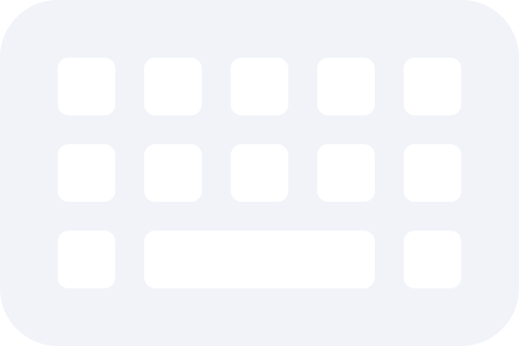

# Notes App

&nbsp;

## About this project

Notes App built using MERN Stack. The fontend is built with React, Vite and Bootstrap, the backend is built with Node.js and Express.js and database using MongoDB

&nbsp;

## File Added

Added .env

````txt
DATAVASE_URL=YOUR_DATABASE_CONNECTION_STRING
PORT=PORT
````

## Features

- CREATE
- READ
- UPDATE
- DELETE
- SEARCH FOR SPECIFIC NOTES

&nbsp;

# Creation By

&nbsp;



